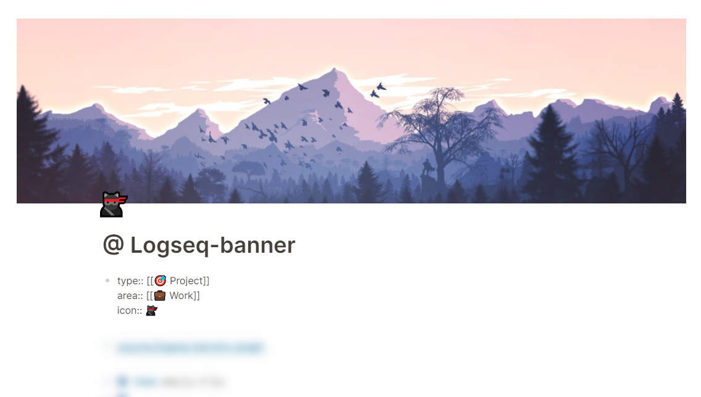
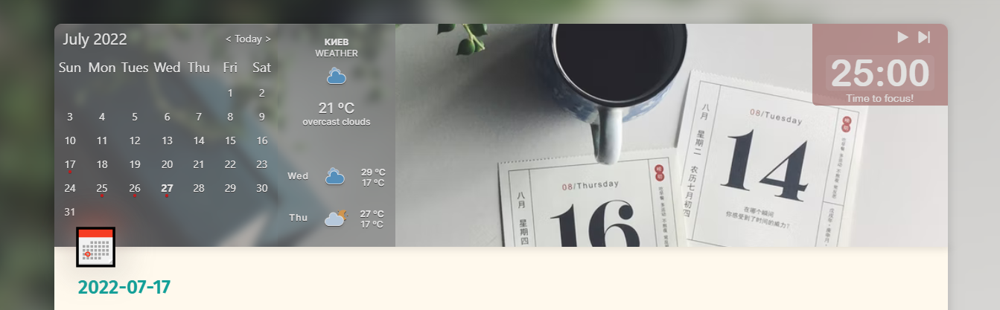
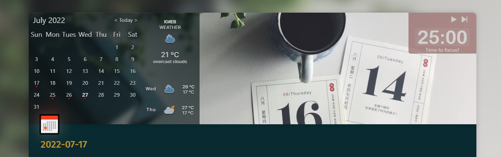
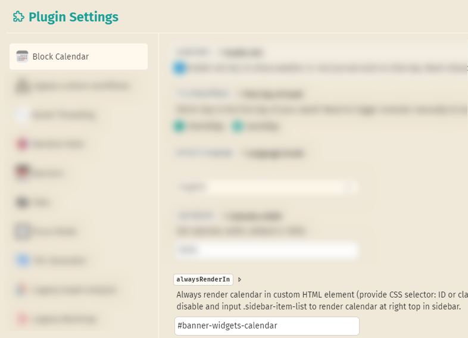

### If you ❤ what i'm doing - you can support my work! ☕

## Logseq Banners plugin
Enliven your Logseq Workspace with gorgeous, custom, Notion style page banners and icons

## Features
* You can set image & icon via plugin settings or via page props
* Hide plugin related page props for more clean view
* Banners and icons default sizes
* Banners and icons default vertical align
* Separate settings for journals and common pages
* Preconfigured widgets:
    * 📅 Calendar (via "Block calendar") plugin support
    * 🌤 Weather
    * 🍅 Pomodoro
    * 💬 Random quote
* Options for widgets "off / journals / everywhere"
* Separate settings for each widget

## Instructions
* Install the plugin from the Logseq plugin marketplace
* Configure a default images and icons in "Settings -> Plugin Settings -> Banners"
* Customize the banner image on special page via the page props:
    * `banner:: https://wallpaperaccess.com/full/1146672.jpg`
* Local assets supported also:
    * add image in Logseq note and just copy it's path to props 🎉
    * for ex. `banner:: ../assets/image_1656373162335_0.png`
* To avoid Logseq show banner preview in props area - wrap it with doublequotes!
    * `banner:: "http://........"`
* To disable default banner - just delete URL from settings
* To hide banner image on some pages use:
    * `banner:: false`
*  Sometimes important banner parts cropped on default vertical align "50%" (center), so you can do fine tune with page props:
    * top: `banner-align:: 0%`
    * bottom: `banner-align:: 100%`
* Customize the page icon on a per page basis via the page props:
    * `page-icon:: 💸`
    * or use native Logseq `icon:: 💸`
* To disable default icon - just delete emoji from settings

## Customizations
* All customizations (a lot!) can be done from plugin settings ("Settings -> Plugin Settings -> Banners") in nice grouped blocks:
* Example for advanced settings (JSON) for custom page types: "Settings -> Plugin Settings -> Banners -> Advanced settings -> Advanced custom pages banners and icons config -> Edit settings.json"

## Widgets

### Calendar
* Install "Block calendar" plugin from Logseq Marketplace
* Go to installed plugin settings ""Settings -> Plugin Settings -> Block calendar"
* Set "Always render" to `#banner-widgets-calendar` banner placeholder
* 

### Weather
* Go to [Indify – Notion Widgets](https://indify.co), Sign Up
* Choose "Weather widget", set your city
* Set "Number of days" - 2
* ⚠ Copy YOUR personal widget ID and replace default in plugin Settings!
* Adjust weather width, so your city name is hidden on left

### Random quote
* Set your `#tag` in plugin Settings

### Custom HTML (iframes, etc...)! (you can set your own, here is some pre-configured):
* Pomo-focus (from https://pomofocus.io/app)

For more tune use your own `custom.css` to position widgets iframes inside of banner area via CSS `position:absolute` & `top/right/bottom/left`.

## Unsplash API tips

* You can use them as default page/journal banner:
    * Random featured: `https://source.unsplash.com/featured/1600x900`
    * Photo of the day: `https://source.unsplash.com/1600x900/daily`
    * Search terms. Add comma separated terms after `?` at the end (for default settings or in props at specific page): `https://source.unsplash.com/1600x900?red,house`

For ex. "Dafault journal banner" - `https://source.unsplash.com/featured/1600x900?diary`

## Credits
- This plugin was originally created by [@sawhney17](https://github.com/sawhney17) (buy him a coffee also! https://www.buymeacoffee.com/sawhney17 ☕)
- Currently maintaned and extended by me - [@yoyurec](https://github.com/yoyurec)
